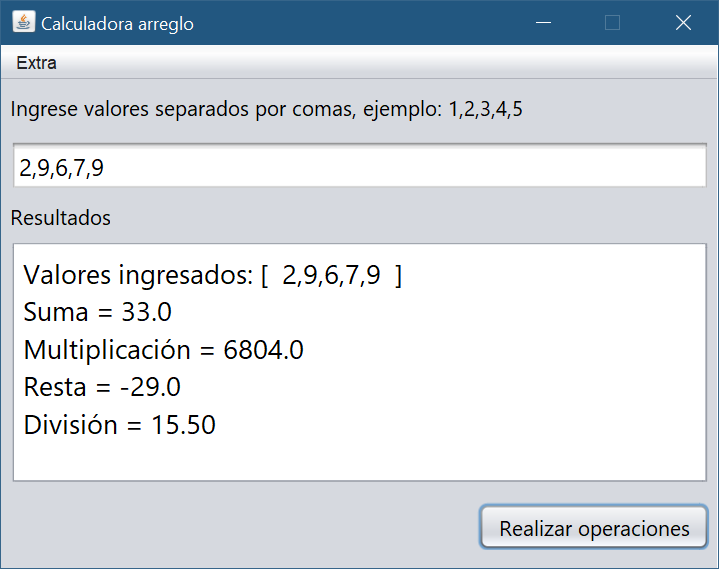
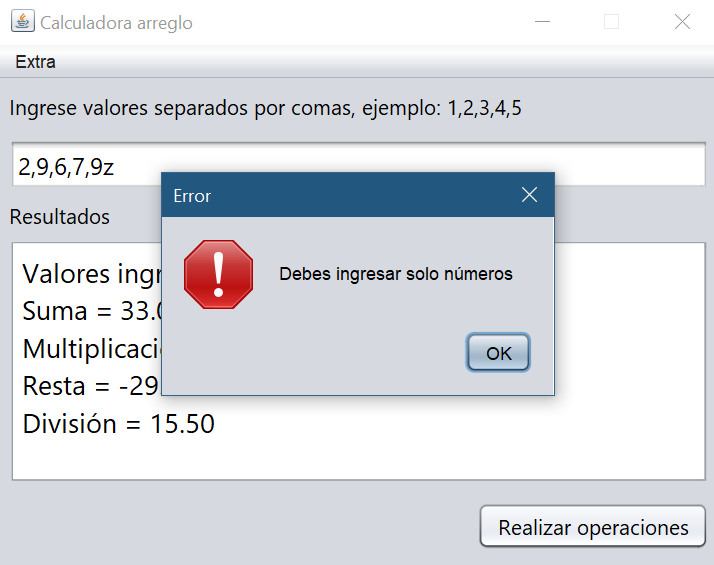
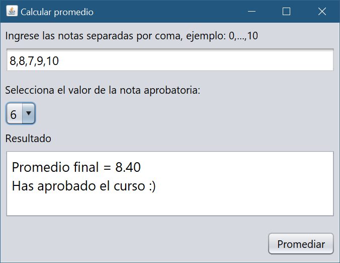
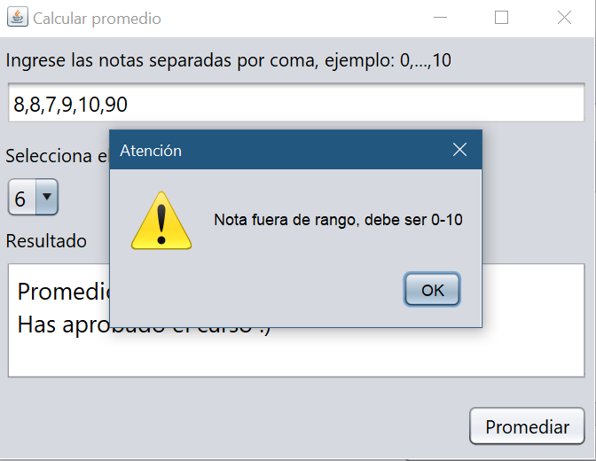
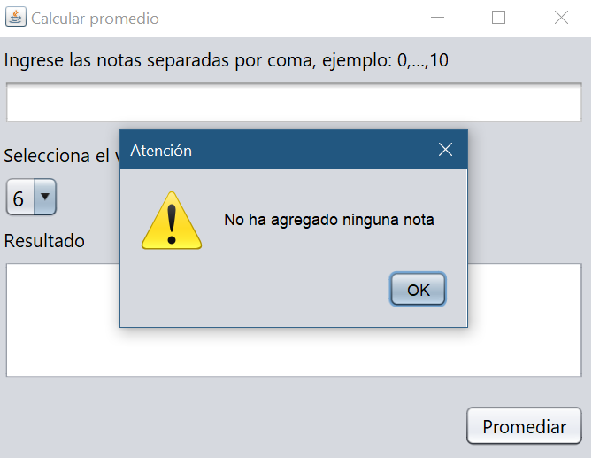

# Calculadora array y promedio
## Lenguaje Java

El programa es capaz de hacer las operaciones b&aacute;sicas. Existe un peque&ntilde;o men&uacute; que lleva a una calculadora para sacar el promedio de una nota escolar, mostrando en pantalla el promedio y el estado del curso.

Nota: El ejecutable **.jar** está en la carpeta **dist**.

---
### 1- Calculadora array, operaciones b&aacute;sicas

**C&aacute;lculo exitoso**

**Ingresar valor no num&eacute;rico**

### 2- Calculadora promedio

**C&aacute;lculo exitoso**

**Nota fuera de rango**

**Sin registrar valores**